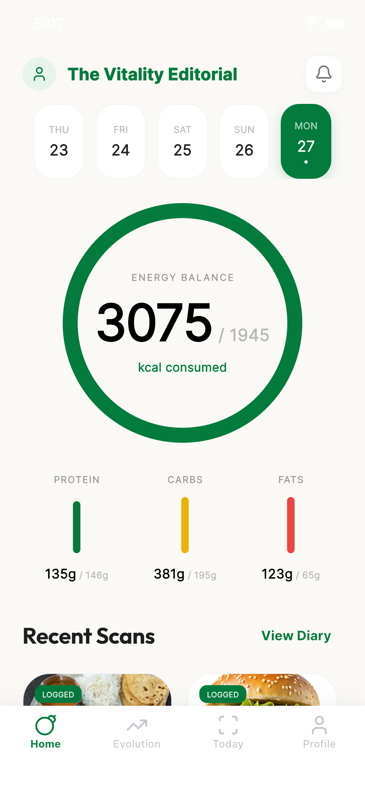
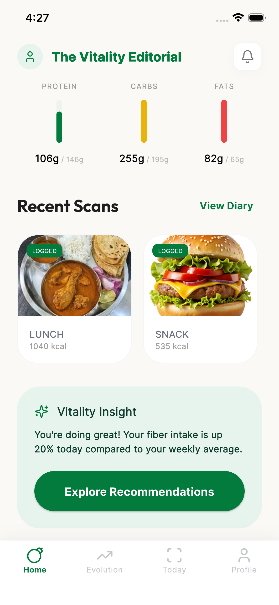
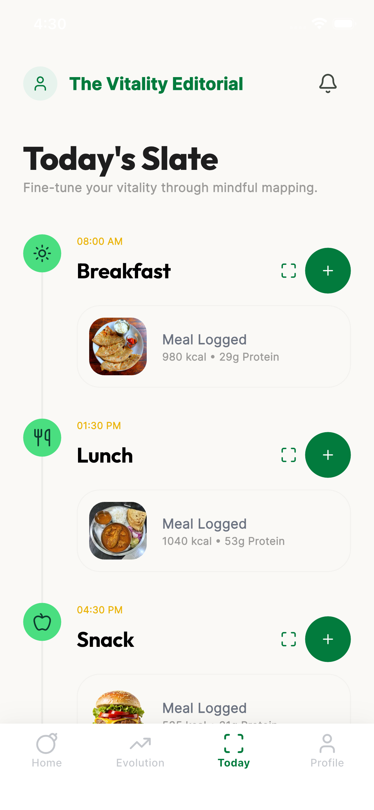
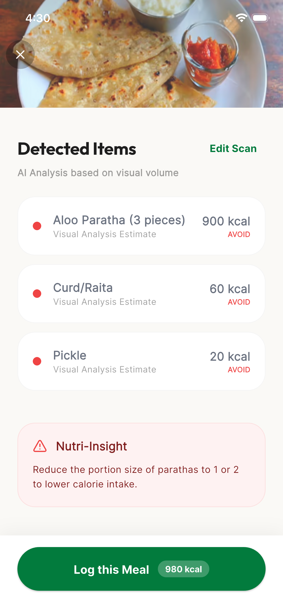
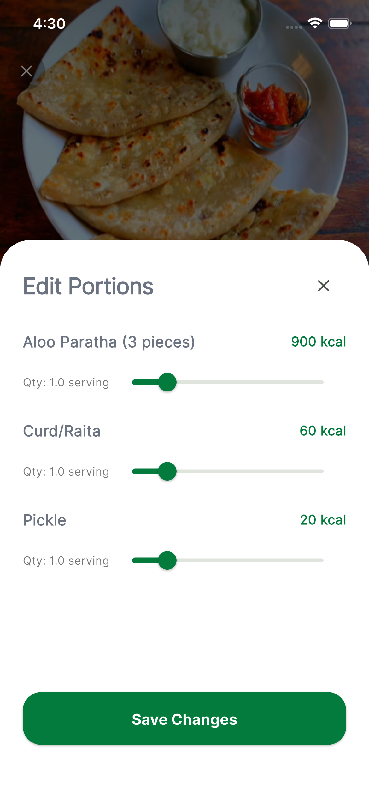
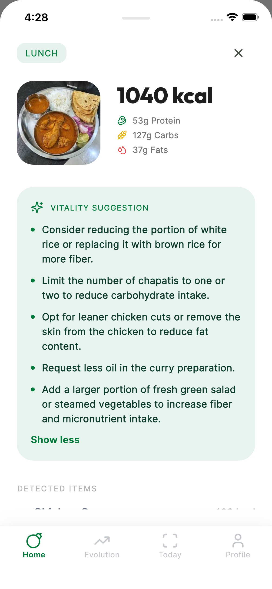
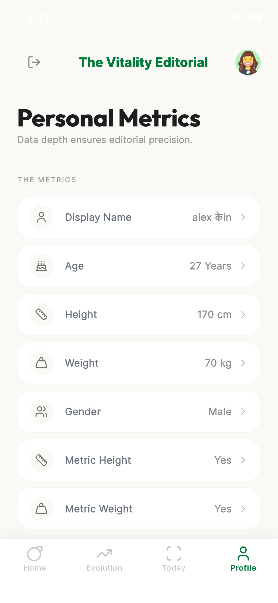
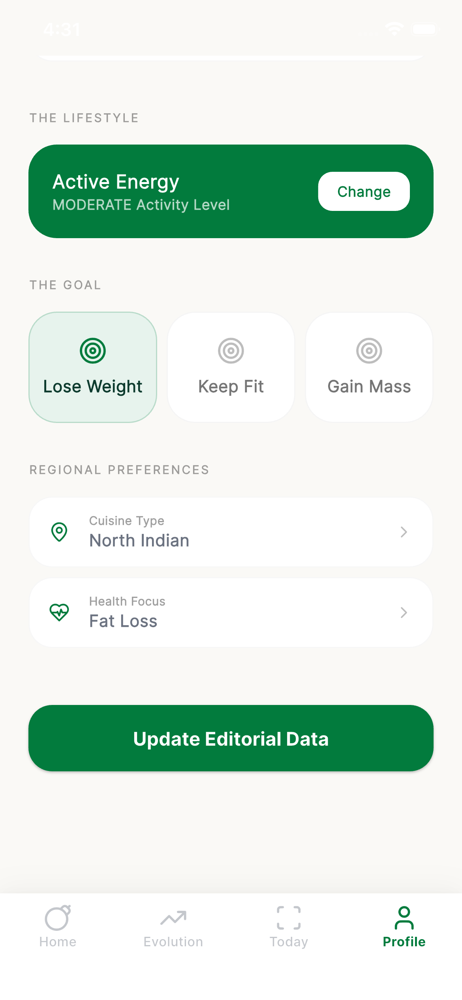

# MealMitra

MealMitra is a comprehensive Flutter-based health and fitness application designed to help users achieve their weight management and fitness goals through personalized nutrition tracking, workout planning, and habit formation.

## Screenshots

<div align="center">
  
  
  
  
  
  
  
  
</div>

## Features

- **User Authentication**: Secure sign-up and login using Firebase Authentication.
- **Profile Management**: Comprehensive user profile with detailed body metrics (age, gender, height, weight).
- **Personalized Goals**: Set goals for weight loss, muscle gain, or maintenance.
- **Activity Tracking**: Log daily physical activity levels.
- **Health Conditions**: Track and manage health conditions (e.g., Diabetes, Hypertension).
- **Calorie & Macro Tracking**: Track daily calorie intake and macronutrient distribution.
- **Workout Planning**: Create and follow personalized workout routines.
- **Habit Formation**: Build healthy habits with streaks and reminders.
- **Progress Monitoring**: Visual dashboards and charts to track progress over time.
- **Recipe Recommendations**: AI-powered recipe suggestions tailored to dietary needs.
- **Water Intake Tracking**: Monitor daily hydration levels.
- **Dark Mode**: Support for both light and dark themes.

## Getting Started

### Prerequisites

- **Flutter**: Version 3.0.0 or higher.
- **Dart**: Version 2.17.0 or higher.
- **Firebase Project**: A Firebase project set up with:
  - Authentication (Email/Password, Google)
  - Firestore Database
  - Firebase Storage

### Installation

1. **Clone the repository**:
   ```bash
   git clone <repository-url>
   cd mealmitra
   ```

2. **Install dependencies**:
   ```bash
   flutter pub get
   ```

3. **Configure Firebase**:
   - Create a `firebase_options.dart` file in the `lib/` directory.
   - Add your Firebase configuration to this file.
   - Ensure `google-services.json` (Android) and `GoogleService-Info.plist` (iOS) are placed in the respective `android/app/` and `ios/Runner/` directories.

4. **Run the application**:
   ```bash
   flutter run
   ```

## Project Structure

```
mealmitra/
├── lib/
│   ├── core/
│   │   ├── constants/        # App constants and configuration
│   │   ├── providers/        # Riverpod providers
│   │   ├── services/         # External services (Firebase, etc.)
│   │   └── utils/            # Utility functions
│   ├── features/
│   │   ├── auth/             # Authentication flows
│   │   ├── profile/          # User profile management
│   │   ├── dashboard/        # Main dashboard and home screen
│   │   ├── tracking/         # Food and water tracking
│   │   ├── workouts/         # Workout planning and tracking
│   │   ├── habits/           # Habit formation and streaks
│   │   ├── recipes/          # Recipe recommendations
│   │   └── settings/         # App settings and preferences
│   ├── shared/
│   │   ├── widgets/          # Reusable UI components
│   │   └── models/           # Data models
│   └── main.dart             # App entry point
├── android/                  # Android native code
├── ios/                      # iOS native code
├── test/                     # Unit and widget tests
└── pubspec.yaml              # Project dependencies
```

## Development

### State Management

We use **Riverpod** for state management. Key providers include:
- `authStateProvider`: Manages user authentication state.
- `currentProfileProvider`: Manages the current user profile.
- `foodLogProvider`: Manages daily food logs.
- `workoutProvider`: Manages workout plans and progress.

### UI Components

Reusable UI components are located in `lib/shared/widgets/`. These include:
- `CustomAppBar`: App-wide navigation bar.
- `PrimaryButton`: Primary action buttons.
- `StatCard`: Displaying key metrics.
- `ProgressChart`: Visual progress tracking.

### Data Models

Data models are defined in `lib/shared/models/` and include:
- `UserProfile`: User profile data.
- `FoodLog`: Daily food entries.
- `Workout`: Workout routines.
- `Habit`: Trackable habits.

## Testing

Run tests using:
```bash
flutter test
```

## License

This project is licensed under the MIT License - see the [LICENSE](LICENSE) file for details.

## Contributing

Contributions are welcome! Please feel free to submit a Pull Request.

## Contact

For questions or support, please open an issue or contact the development team.
# mealmitra
